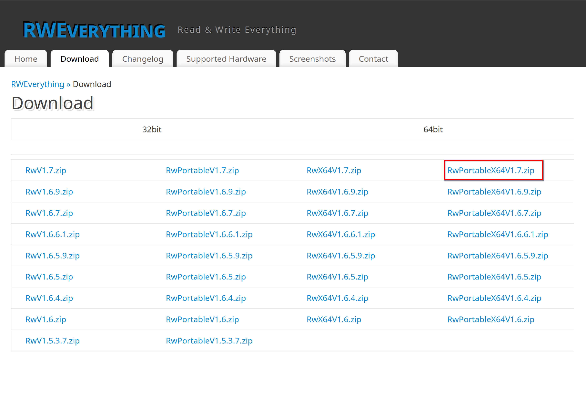
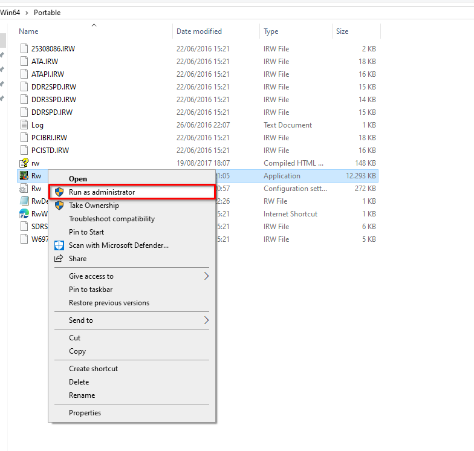
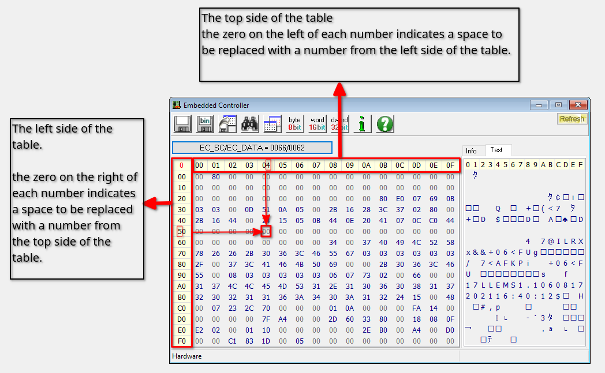

# Intro
To get your MSI laptop supported, there are two main methods, one that
requires windows to be installed, and the other works directly on linux.

If you have any bios/firmware updates on the official MSI website, and
you haven't updated yet then **DO NOT UPDATE!** follow the guide first:

## Windows method(recommended):

1. Install Windows 10/11 normally, booting directly from a live usb or
any other trick won't work, however windows activation is not
needed.

2. After a successful installation, make sure to download/install all
Windows updates from the settings
(windows can't update bios/firmware automatically on MSI
laptops but that doesn't mean you have to update them yourself,
instead continue following the guide).

3. Install the MSI app designed for your laptop: MSI dragon center /
MSI creator center / MSI center / MSI center pro (the correct app
can be found on the support page for your laptop).

4. If you fail at step 3, then you most likely need another app. usually
its AMD Adrenalin software / GeForce Experience (nvidia)/ or intel
equivalent.

5. Once the MSI app is installed, you can test the functions it offers,
like user scenario and battery charge limit.

6. If everything works as expected, download RWEverything:
https://rweverything.com/download/ 

7.  Launch it as administrator:

8. Navigate to the EC tab (page):

9. Here you should see a table of all the values your Embedded Chip has in its memory.\
The values you see can be changed manually (by writing to them)\
\
DO NOT DO THAT: writing the wrong the values to the wrong address might brick the laptop completely and EC/BIOS RESET CAN'T FIX THAT! 

10. Change the reading speed to 500-600ms,
this makes it easier to see how the
values react to the MSI app settings:

11. Reading addresses: lets say you are looking for a specific address
0x54 (0xFirstNumberSecondNumber) FirstNumber can be found
on the left side of the table and SecondNumber can be found on
the top side of the table:

Each **Address** contains a **Value**, when you locate an **Address** inside the
table you can write it like this 0x54 = 00 (**Address** = **Value**)
This **Value** can change depending on what it is related to, if you find the
**Address** for CPU temperature; the **Value** will change on its own, if you
find the **Address** for battery charge limit, then the **Value** won't change
until you change the settings in the MSI app.

Example: To figure out which **Address** is used by user scenario (`shift
mode`) go to the user scenario page in the MSI app and keep changing it
while looking at the EC table.

Eventually you'll notice a **Value** that changes each time you change the
setting (or maybe two **Values** in two **Addresses** that change at the same
time), once you find the **Address**, you can start writing down the **Value**
for EACH user scenario, so you can report it.

### Linux method

***

This method has limited results compared to the Windows method, because most
MSI laptop features are tied to software toggles that can be only found in their apps
installed on windows.

If you are lucky, your laptop model will have similar addresses to another laptop
that is already supported by the driver, but usually this only happens on some
features like cooler boost and battery charge limit.

To start, You need to load a module called `ec_sys`:

* `sudo modprobe ec_sys`

if you need to write to a specific address (but you really shouldn’t) you can enable
Read/Write mode for this module:

* `sudo modprobe ec_sys write_support=1`

After that you can extract the EC table and print it on the terminal:

* `hexdump -C /sys/kernel/debug/ec/ec0/io`

or you can put it in a .txt file in your home folder directly:

* `cat /sys/kernel/debug/ec/ec0/io > ec.dump`

then you can send us the output, and wish us luck.

P.S: you should repeat the method you used after EACH BIOS/Firmware update, the reason you
shouldn’t update before following the guide is that the values and addresses could change after
updating, and it is important to support all versions of the BIOS/Firmware or the driver might
not work after the update.
