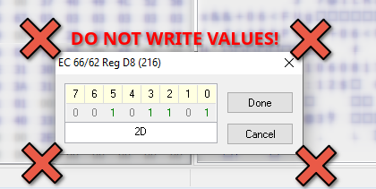
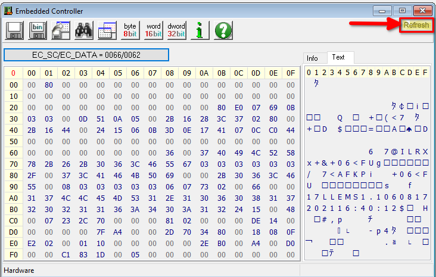

# Intro
There are two main methods to get your MSI laptop supported: the recommended method requires Windows to be installed, and the other works directly on Linux.

> [!IMPORTANT]
> If there are any BIOS/firmware updates available for your laptop, follow this guide for your current firmware before installing any of them. Then repeat the process for each new firmware version you install from the official MSI website. This is required to obtain support for older firmware as the EC configuration may vary across the versions.

# Table of contents (rough)

+ FW naming and WMI versioning explanation
+ [Windows](#windows-method-recommended)
  + [RWE guide](#windows-method-recommended)
  + [MsiEcRamEditor](https://github.com/timschneeb/MsiEcRamEditor) (WMI2 only)
+ [Linux](#linux-method)
  + [`msi-ec`](#msi-ec-debug-mode)
  + [`ec-sys`](#ec-sys-method)
  + [dd from `/dev/mem`](#reading-the-ec-ram-mapped-to-system-memory)
+ Known addresses

# Windows method (recommended):

1. Install Windows 10/11 normally, booting directly from a live usb or
any other trick won't work, however windows activation is not
needed.

2. After a successful installation, make sure to download/install all
Windows updates from the settings
(windows can't update bios/firmware automatically on MSI
laptops but that doesn't mean you have to update them yourself,
instead continue following the guide).

3. Install the MSI app designed for your laptop: MSI dragon center /
MSI creator center / MSI center / MSI center pro (the correct app
can be found on the support page for your laptop).

4. If you fail at step 3, then you most likely need another app. usually
its AMD Adrenalin software / GeForce Experience (nvidia)/ or intel
equivalent.

5. Once the MSI app is installed, you can test the functions it offers,
like user scenario and battery charge limit.

6. If everything works as expected, download RWEverything:
https://rweverything.com/download/ 

7.  Launch it as administrator:

8. Navigate to the EC tab (page):

9. Here you should see a table of all the values your Embedded Chip has in its memory.

> [!CAUTION]
> **Do not attempt to edit the memory manually. Writing the wrong the values to the wrong addresses will DAMAGE YOUR HARDWARE or even BRICK YOUR DEVICE! This can't be reversed by resetting the EC or BIOS.**

10. Change the refresh rate to 500-600ms,
this makes it easier to see how the values react to the changes in the MSI app settings:

11. Reading the table:

Each address is a hexadecimal number.
Let's say you are looking for a specific address `0x54`.
The first number `5` can be found on the left side of the table and second number `4` can be found on the top side of the table:

Each **Address** contains some **Value**. When you locate an **Address** inside the
table you can take a note of its content: 0x54 = 00 (**Address** = **Value**)
This **Value** will change depending on the parameters related to it.

Some parameters will be changing automatically without your intervention (e.g. the CPU temperature), others will change in response to different settings in the MSI app (e.g. battery charge limits)

Example: To figure out which **Addresses** are used by user scenarios (or shift
modes) go to the user scenario page in the MSI app and keep switching the scenarios
while looking at the EC table.

Eventually you'll notice one or more values that change each time you change the
setting, once you find them, you can start writing down the addresses and values
corresponding to *each* user scenario, so you can report them.

# Linux method

This method is very limited compared to the Windows method, because most
MSI laptop features are tied to software toggles that can only be found in the official Windows apps.

If you are lucky, your laptop model will have similar addresses to another laptop
that is already supported by the driver, but usually this only happens on some
features like cooler boost and battery charge limit.

On Linux, you can do the EC dump in several ways.
+ `msi-ec` built-in debug mode (git version only)
+ `ec-sys` kernel module
+ By reading the memory that is virtually mapped to EC

To request support for your device model, make the EC dump in text form
and open the [Issue on Github](https://github.com/BeardOverflow/msi-ec/issues/new?assignees=&labels=New+firmware&projects=&template=support_request.yml).

## `MSI-EC` debug mode

Make sure that you are running the git version of the module.
If not, follow the installation guide in the [Readme](../README.md#Installation) file.

Unload module if it was previously loaded:

+ `sudo modprobe -r msi-ec`

Load module with debug mode enabled:

+ `sudo modprobe msi-ec debug=true`

Make a dump by reading the module pseudo file:

+ `cat /sys/devices/platform/msi-ec/debug/ec_dump`

Or save it to file:

+ `cat /sys/devices/platform/msi-ec/debug/ec_dump > ec_dump.txt`

If you got the next error, then your module is not loaded in debug mode or doesn't have it:

> `cat: /sys/devices/platform/msi-ec/debug/ec_dump: No such file or directory`

## `EC-SYS` method

> [!NOTE]
> The `ec-sys` module may not be included in some distros, such as Fedora.

To start, You need to load a module called `ec_sys`:

* `sudo modprobe ec_sys`

[//]: # (If you need to write to a specific address &#40;but you really shouldn’t&#41; you can enable)
[//]: # (Read/Write mode for this module:)
[//]: # ()
[//]: # (* `sudo modprobe ec_sys write_support=1`)

After that you can extract the EC table and print it on the terminal in text form:

* `hexdump -C /sys/kernel/debug/ec/ec0/io`

Or save it to file:

+ `hexdump -C /sys/kernel/debug/ec/ec0/io > ec_dump.txt`

If you need dump in binary form:

* `cat /sys/kernel/debug/ec/ec0/io > ec_dump.bin`

## Reading the EC RAM mapped to system memory

Some devices have EC memory mapped to system memory address `0x0xFC000800`,
so you can read it from the `/dev/mem` pseudo file with `dd`.

`/dev/mem` may not be supported on some distros. For details, see `man mem`.

> [!WARNING]
> Reading random parts of the system memory can reveal your secrets, so check the dump before you post it to Github.

To read EC memory in text form run:

+ `sudo dd if=/dev/mem bs=1 skip=4227860480 count=256 | hexdump -C`

To save EC memory in text form run:

+ `sudo dd if=/dev/mem bs=1 skip=4227860480 count=256 | hexdump -C > ec_dump.txt`

To make binary dump run:

+ `sudo dd if=/dev/mem bs=1 skip=4227860480 count=256 > ec_dump.bin`
